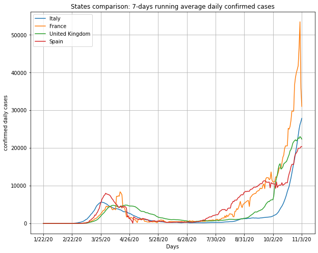

# COVID-19 Data Visualization

In this project my aim is to play with the selected datasets, generate plots and animations and improve my data visualization skills.

### Main features developed:
*   Plot daily/cumulative data** of signle country;  

*   Plot Comparative daily/cumulative data** of multiple countries;  

*   Plot a pie chart of the data*;  

*   Plot a bar chart of data*** w.r.t. country population;  

*   Generate an animation of a pie chart of the data** from Jan to today;
*   Generate an animation of a bar chart of the data*** from Jan to today;
*   Plot color filled single country plot with cases & deaths together;  

*   Plot comparative daily/cumulative N-days running averaged data** of a single country;  

(\*\*) Refers to: confirmed, deaths and recovered cases  
(\*\*\*) Refers to: confirmed, deaths and recovered cases + usage of population data  

### Datasets:

*   __COVID-19 Data Repository__ by the Center for Systems Science and Engineering at Johns Hopkins University ([CSS JHU repository](https://github.com/CSSEGISandData/COVID-19))
*   __Population by country 2020__ from the [Kaggle website](https://www.kaggle.com/tanuprabhu/population-by-country-2020)

### Repository structure:
* Code of the project available in two versions: .py & .ipynb (it is suggested to work on *Google Colaboratory* as I did and it is guaranteed to work);
* A local copy of the population dataset that for simplicity is in this repository to be automatically imported while running the code;
* README.md file and possibly some images used for this presentation;
